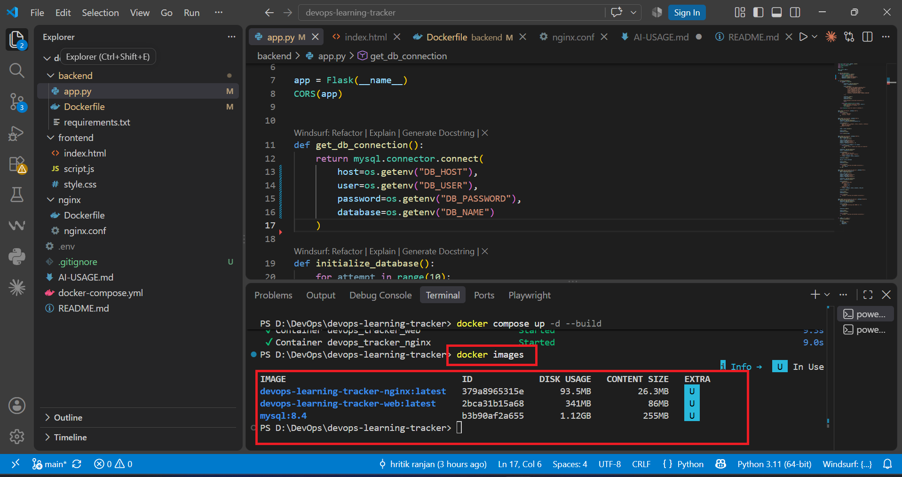

# DevOps Learning Tracker

A simple three-tier application built with **Flask, MySQL, Nginx and Docker Compose**.

The main purpose of this project is to practice containerisation, service communication, database persistence and reverse proxy configuration using Docker Compose.

## Submission Walkthrough

Video walkthrough of my DevOps assessment submission:

[Watch the 5-minute walkthrough on YouTube](https://youtu.be/ixK2aGKkBu0)

## Architecture

```text
User
  |
  v
Nginx
(Reverse Proxy)
  |
  v
Flask
(Web Application)
  |
  v
MySQL
(Database)
  |
  v
Docker Volume
```

All three services are connected through the same Docker bridge network.

## Services

* **Nginx** – Reverse proxy and entry point
* **Flask** – Backend application
* **MySQL** – Database
* **Docker Volume** – Stores database data

## Run the Project

Clone the repository:

```bash
git clone https://github.com/hritikranjan1/devops-learning-tracker.git
cd devops-learning-tracker
```

Create the environment file:

```powershell
copy .env.example .env
```

Start the application:

```bash
docker compose up -d --build
```

Check the services:

```bash
docker compose ps
```

Open the application:

```text
http://localhost:8082
```

## Database Readiness

MySQL has a health check using `mysqladmin ping`.

The Flask service waits for the database to become healthy before starting:

```yaml
depends_on:
  db:
    condition: service_healthy
```

This ensures that the application does not start only because the MySQL container has started; it waits until MySQL is ready to accept connections.

## Data Persistence

MySQL data is stored using a named Docker volume:

```yaml
volumes:
  - mysql_data:/var/lib/mysql
```

The data survives:

```bash
docker compose down
docker compose up -d
```

The volume is only removed when `-v` is used.

## Security

* Database credentials are stored in `.env`.
* `.env` is included in `.gitignore`.
* `.env.example` contains placeholder values only.
* Database credentials were removed from the Git history.
* The Flask application runs as a non-root user.

## Resource Limits

Memory limits are configured for all three services:

| Service | Memory Limit |
| ------- | -----------: |
| MySQL   |       512 MB |
| Flask   |       256 MB |
| Nginx   |       128 MB |

The limits are kept small because this is a lightweight application. MySQL gets more memory because it is the database service, while Flask and Nginx have smaller workloads.

## Docker Images

The final images were checked using:

```bash
docker images
```



## Most Awkward Requirement

The most awkward part was getting the complete stack to start correctly from Docker Compose. I initially faced an issue with the Flask Docker build because of the build context and also had a host port conflict with Nginx. I fixed the build configuration, changed the host port, and then verified the MySQL health check and service dependency so that the application starts correctly after the database is ready.

## Stop the Application

```bash
docker compose down
```

To remove the database volume as well:

```bash
docker compose down -v
```

**Note:** `docker compose down -v` removes the stored MySQL data.


## 👨‍💻 Author

**Hritik Ranjan**
DevOps & Cloud Learner  
GitHub: https://github.com/hritikranjan1  
LinkedIn: https://www.linkedin.com/in/hritikranjan1/  
Blog: https://blogs.hritikranjan.in  
Website: https://hritikranjan.in